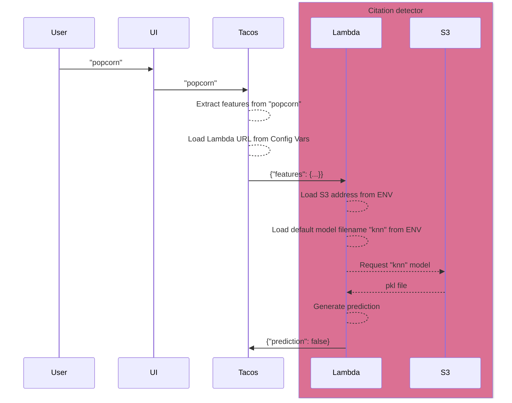

# TACOS citation detector

A lambda to apply a pre-trained algorithm to predict whether a given search string is in the form of a citation. This
function will perform the following work:

1. Receives a set of parameters (submitted to the lambda via POST)
2. Loads a pickle file containing a pre-trained machine learning model.
3. Submits the parameters to the model to generate a binary prediction.
4. Returns the result of that prediction.

This lambda's operation is placed in context of our larger discovery ecosystem in the following diagram. The lambda is
responsible for the shaded region.



## Development

- To preview a list of available Makefile commands: `make help`
- To install with dev dependencies: `make install`
- To update dependencies: `make update`
- To run unit tests: `make test`
- To lint the repo: `make lint`

## Running Locally with Docker

<https://docs.aws.amazon.com/lambda/latest/dg/images-test.html>

- Build the container:

  ```bash
  docker build -t predict:latest .
  ```

- Run the default handler for the container:

  ```bash
  docker run -e WORKSPACE=dev -p 9000:8080 predict:latest
  ```

- Post to the container:

  ```bash
  curl -XPOST "http://localhost:9000/2015-03-31/functions/function/invocations" -d '{}'
  ```

- Observe output:

  ```
  "You have successfully called this lambda!"
  ```

## Environment Variables

### Required

```shell
SENTRY_DSN=### If set to a valid Sentry DSN, enables Sentry exception monitoring. This is not needed for local development.
WORKSPACE=### Set to `dev` for local development, this will be set to `stage` and `prod` in those environments by Terraform.
```

### Optional

_There are no optional ENV at this time._
