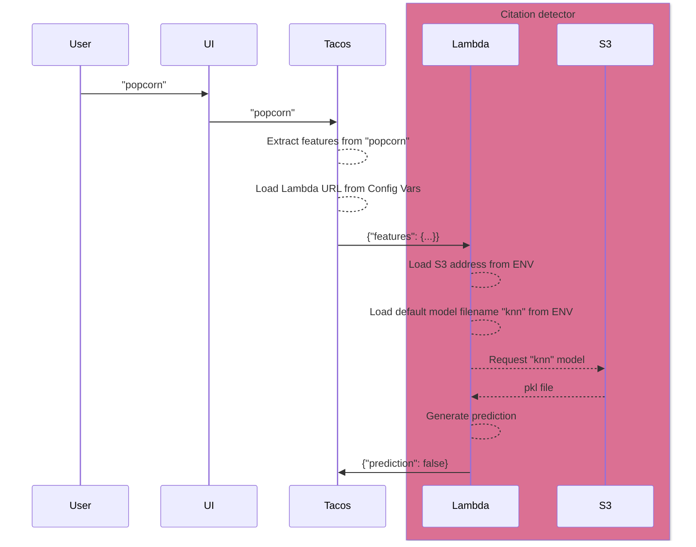

# TACOS citation detector

A lambda to apply a pre-trained algorithm to predict whether a given search string is in the form of a citation. This
function will perform the following work:

1. Receives a set of parameters (submitted to the lambda via POST)
2. Loads a pickle file containing a pre-trained machine learning model.
3. Submits the parameters to the model to generate a binary prediction.
4. Returns the result of that prediction.

This lambda's operation is placed in context of our larger discovery ecosystem in the following diagram. The lambda is
responsible for the shaded region.



## Development

- To preview a list of available Makefile commands: `make help`
- To install with dev dependencies: `make install`
- To update dependencies: `make update`
- To run unit tests: `make test`
- To lint the repo: `make lint`

## Testing Locally with AWS SAM

### Sam Installation

Ensure that AWS SAM CLI is installed: https://docs.aws.amazon.com/serverless-application-model/latest/developerguide/install-sam-cli.html

All following actions and command should be performed from the root of the project (i.e. same directory as the
`Dockerfile`).

### Building and Configuration

1. Create a JSON file for SAM that has the environment variables for the container.

   - Copy `tests/sam/env.json.template` to `tests/sam/env.json` (which is git ignored)
   - Fill in missing sensitive env vars

   **NOTE:** AWS credentials are automatically passed from the terminal context that runs `make sam-run`; they do not
   need to be explicitly set as env vars.

2. Build Docker image:

```shell
make sam-build
```

### Invoking lambda via HTTP requests

The following outlines how to run the Lambda SAM docker image as an HTTP endpoint, accepting requests and returning
responses similar to a lambda behind an ALB, Function URL, or API Gateway.

1. Ensure AWS Dev credentials set in terminal and any other env vars in `tests/sam/env.json` are up-to-date.

   (_TODO: Update once an AWS SSO role is created for this project._)

2. Run HTTP server:

```shell
make sam-http-run
```

This starts a server at `http://localhost:3000`. Requests must include a path, e.g. `/foo`, but are arbitrary insofar as
the lambda does not utilize them in request payload.

3. In another terminal, perform an HTTP request via another `Makefile` command:

The server's baseline readiness can be confirmed via the ping action:
```shell
make sam-http-ping
```

The response should have an HTTP status of `200` and respond with:

```json
{
  "response": "pong"
}
```

Actual predictions can be sent in via the predict action:

```shell
make sam-http-predict
```

```json
{
  "response": "True"
}
```

Custom payloads can be found in the `tests/sam` directory, and the default payload overridden via the `PAYLOAD` Makefile
argument:

```shell
make sam-http-predict PAYLOAD=tests/sam/noncitation.json
```

```json
{
  "response": "False"
}
```

### Invoking lambda directly

While lambdas can be invoked via HTTP methods (ALB, Function URL, etc), they are also often invoked directly with an
`event` payload. To do so with SAM, you do **not** need to first start an HTTP server with `make sam-run`, you can
invoke the function image directly:

#### Example 1: ping
```shell
echo '{"action": "ping", "challenge_secret": "secret_phrase"}' | sam local invoke --env-vars tests/sam/env.json -e -
```

Response:

```text
{"statusCode": 200, "statusDescription": "200 OK", "headers": {"Content-Type": "application/json"}, "isBase64Encoded":
false, "body": "{\"response\": \"pong\"}"}
```

#### Example 2: predict

The JSON files with example payloads in `tests/sam` can be helpful for working with the `predict` action, rather than
trying to include all features and values directly within an echo command:

```shell
echo "$(cat tests/sam/citation.json)" | sam local invoke --env-vars tests/sam/env.json -e -
```

Response:

```text
{"statusCode": 200, "statusDescription": "200 OK", "headers": {"Content-Type": "application/json"}, "isBase64Encoded":
false, "body": "{\"response\": \"True\"}"}
```

As you can see from these responses, the lambda is still returning a dictionary that _would_ work for an HTTP response,
but is actually just a dictionary with the required information.

It's unknown at this time if this lambda will get invoked via non-HTTP methods, but SAM will be helpful for testing and
development if so.

## Environment Variables

### Required

```shell
CHALLENGE_SECRET=### Secret string that is passed as part of lambda invocation payload, and checked before running
WORKSPACE=### Set to `dev` for local development, this will be set to `stage` and `prod` in those environments by Terraform.
```

### Optional

```shell
SENTRY_DSN=### If set to a valid Sentry DSN, enables Sentry exception monitoring. This is not needed for local development.
```

## Related Assets

- [mitlib-tf-workloads-tacos](https://github.com/MITLibraries/mitlib-tf-workloads-tacos) for the infrastructure that supports this application
- [mitlib-tf-workloads-ecr](https://github.com/MITLibraries/mitlib-tf-workloads-ecr) for the ECR infrastructure for the container image
